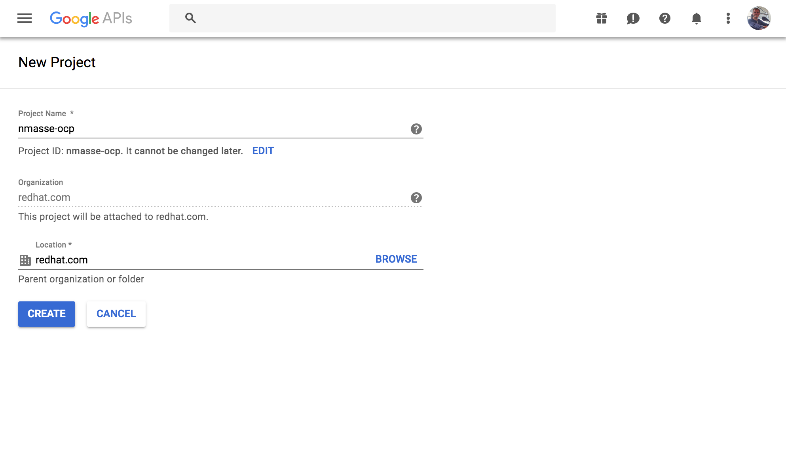
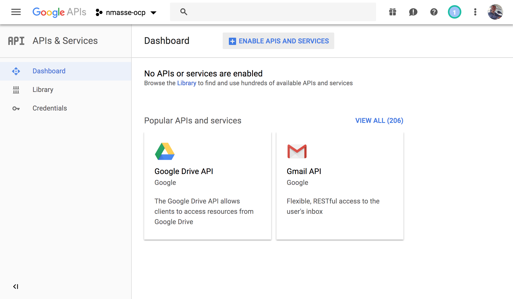
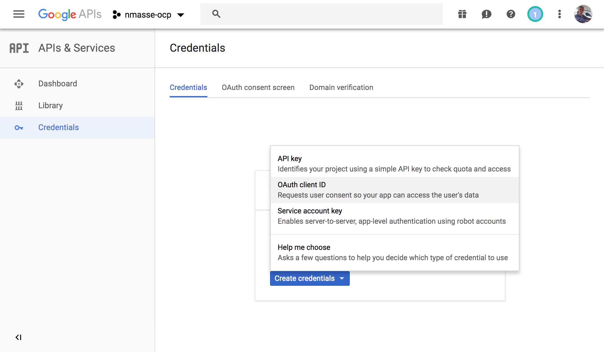
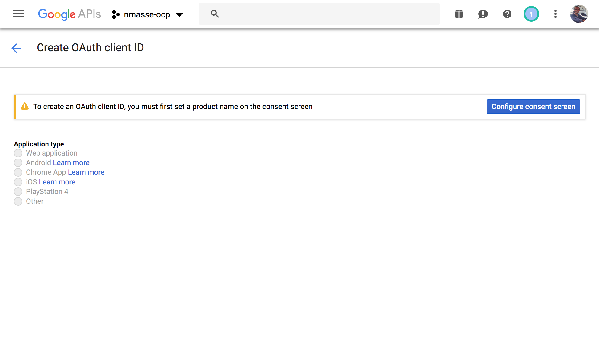
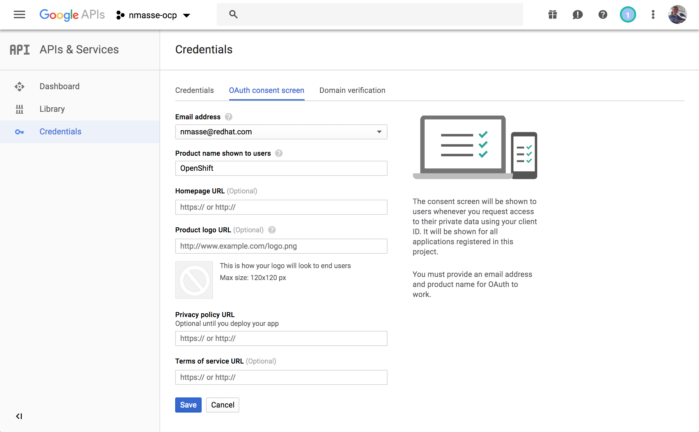
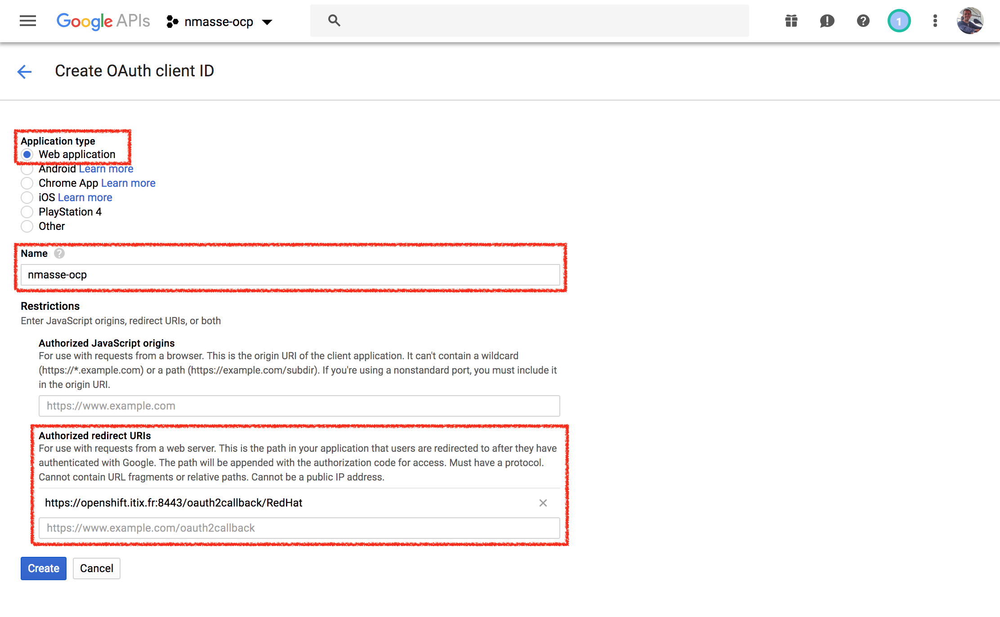
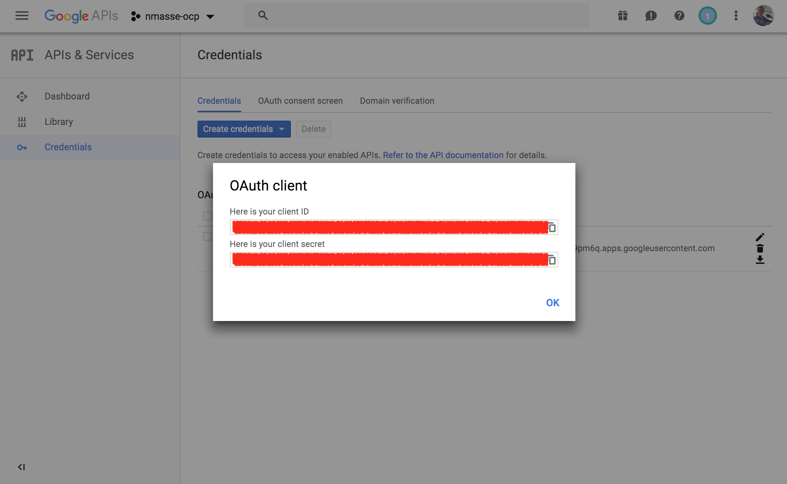
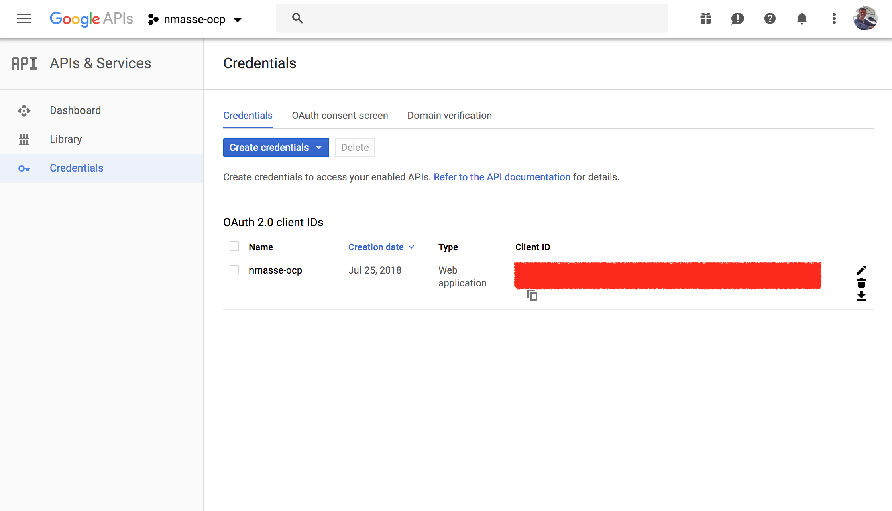

# Login to OpenShift with your Google Account

## Context

As Solution Architect or Consultant at Red Hat, we often spin up new OpenShift
clusters. By convenience, those clusters are often in the Cloud and are publicly
facing the Internet.

This is very convenient because we can share those clusters with team mates, and
being public on the Internet, we can work from anywhere.

But most of us, would just create a default admin account, very originally named
`admin` with a password that ranges from `redhat` to `redhat123`.
And instead of creating a user account for our team mates, we would just share
this admin account with them.

As [recent news showed us](https://www.wired.com/story/cryptojacking-tesla-amazon-cloud/),
no password at all or dumb passwords are a bad practice.

What if we could just re-use our Red Hat account on all our OpenShift clusters
and login with this same account on all the OpenShift clusters of our team mates?

No hard-coded admin account. No dumb password.

Let's configure OpenShift to use the Google Identity Provider of Red Hat !

## Setup an OpenID Connect client in the Google Console

- Go to the [Google Developer Console](https://console.developers.google.com/projectselector/apis/dashboard?folder&organizationId=54643501348).
- Make sure `redhat.com` is selected in the top left corner.
- Click on `create`.
  
- Choose a unique project name. (**hint:** include your redhat login in the project name)
  and click `Create`.
  
- Make sure your newly created project is selected in the top left corner and
  click on `credentials` in the left sidebar.
  
- Click on `Create credentials` and select `OAuth Client ID`.
  
- Click `Configure Consent Screen`.
  
- In the product name, type something meaningful such as `OpenShift` and click `Save`.
  
- Select `Web Application` for the application type and give it a name.
- In the `Authorized redirect URIs`, add the OAuth redirect URL of your OpenShift master.
  The URL is `https://`, followed by the master public hostname, followed
  by a colon and the port if it is not standard (eg. `:8443`), followed by `/oauth2callback/`,
  followed by the id of the identity provider in the `master-config.yaml`
  (in the rest of this guide, I will use `RedHat`).
  This should give a URL like this: `https://openshift.itix.fr:8443/oauth2callback/RedHat`
  
- **Write down the generated `client_id` and `client_secret`.**
  

## Configure the OpenShift master

- Login as `root` on your OpenShift master.
- Open `/etc/origin/master/master-config.yaml` in your favourite text editor.
- Drill down to the `oauthConfig` section, `identityProviders` sections and
  add a new entry:

```yaml
oauthConfig:
  identityProviders:
  - name: RedHat
    challenge: false
    login: true
    mappingMethod: claim
    provider:
      apiVersion: v1
      clientID: <paste the generated client_id here>
      clientSecret: <paste the generated client_secret here>
      hostedDomain: redhat.com
      kind: GoogleIdentityProvider
```

- Save the file and restart the master services:

```sh
systemctl restart atomic-openshift-master-api
systemctl restart atomic-openshift-master-controllers
```

## Give it a try

- Go to your OpenShift console.
- Click on `RedHat` if you are prompted with a list of identity providers.
- You should be redirected to Google for authentication. If your web browser is already logged in on Google services, you should just have to consent. Otherwise, you will have to authenticate before consenting.
- You should be logged in.

## Granting rights

When you want to give additional rights to one of your team mates, just login
as `cluster-admin` on your OpenShift master (for instance by logging as root
on your master) and use the `oc adm policy add-cluster-role-to-user` or
`oc adm policy add-role-to-user` to grant rights to the user.

For instance, to give the `cluster-admin` role to a user named `nmasse@redhat.com`, use the following command:

```sh
oc adm policy add-cluster-role-to-user cluster-admin nmasse@redhat.com
```

If you want to give local admin rights on a project named `default` to a user named `nmasse@redhat.com`:

```sh
oc adm policy add-role-to-user admin nmasse@redhat.com -n default
```

If you want to give the view rights on a project named `openshift` to a user named `nmasse@redhat.com`:

```sh
oc adm policy add-role-to-user view nmasse@redhat.com -n openshift
```

## Removing rights

Maybe did you noticed that every user that login on your OpenShift cluster has
default access rights that entitle him or her to create projects and resources
on your cluster ?

You can remove those default rights with this command:

```sh
oc adm policy remove-cluster-role-from-group self-provisioner system:authenticated:oauth
```

You can instead give this right individually to your team mates:

```sh
oc adm policy add-cluster-role-to-user self-provisioner nmasse@redhat.com
```

## Working together on a shared OpenShift instance

Now that your OpenShift instance can authenticate any Red Hat user, you can
share your instance with your team mate! Just give the URL of your master and that's it!

Once your team mate is logged in using his Red Hat account, he or she can ask you privileges
that you can give using the `oc adm policy add-role-to-user` command.

## Provisionning the Identity Provider configuration from the Ansible inventory

Once you are happy with your setup, you can configure the Identity Provider from
within the Ansible inventory.

In the inventory file you used to provision your OpenShift instance, you can
add:

```ini
[OSEv3:vars]
openshift_master_identity_providers=[ { "name": "RedHat", "challenge": false, "login": true, "mappingMethod": "claim", "provider": { "apiVersion": "v1", "clientID": "<paste the generated client_id here>", "clientSecret": "<paste the generated client_secret here>", "hostedDomain": "redhat.com", "kind": "GoogleIdentityProvider" } } ]
```

**Do not forget to replace the `client_id` and `client_secret` by yours !**

If you need to provision multiple clusters, you can re-use the same `client_id`/`client_secret`.
You just need to add the new redirect URI:

- Go to the [Google Developer Console](https://console.developers.google.com/apis/credentials).
- Make sure your project is selected in the top left corner.
- Click on the application you created before.
  
- Add the OAuth callback URL of your new OpenShift cluster to the `Authorized redirect URIs`.
- Click `Save`.
